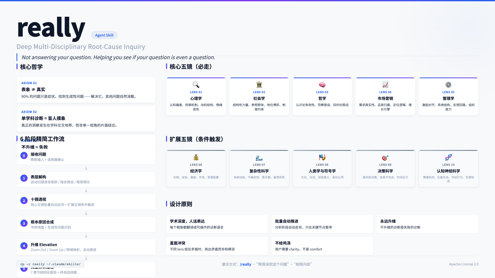

# really — Deep Multi-Disciplinary Root-Cause Inquiry

<p align="center">
  <b>Not answering your question. Helping you see if your question is even a question.</b>
</p>

<p align="center">
  
</p>

<p align="center">
  <a href="#english">🇺🇸 English</a> &nbsp;|&nbsp; <a href="#中文">🇨🇳 中文</a>
</p>

---

## English

**really** is a cross-disciplinary deep-diagnosis Agent Skill. When you face an idea, a problem, or a decision dilemma, it does not give you answers directly. Instead, it excavates through **10 disciplines** to help you see:

- Is your stated question even a **real question**?
- What is the **generative root cause** behind it?
- From a **higher vantage point**, what is this problem actually about?

### Core Philosophy

| # | Axiom | Meaning |
|---|-------|---------|
| 1 | **Symptom ≠ Root Cause** | 90% of problems are symptoms. Find the generative problem — solve it, and the rest dissolve. |
| 2 | **Single-lens diagnosis = blind men touching an elephant** | True insight happens at the intersection of disciplines. |
| 3 | **No elevation = failure** | Every diagnosis must provide information value-add and elevate the user's perspective. |

### The Ten-Lens Diagnostic System

#### Core Five Lenses (Mandatory)

| Lens | Discipline | What It Sees |
|------|-----------|--------------|
| 🔍 1 | **Psychology** | Cognitive biases, defense mechanisms, motivation structures, emotional undercurrents |
| 🏛️ 2 | **Sociology** | Structural forces, reference groups, status games, institutional constraints |
| 🧠 3 | **Philosophy** | Epistemological validity, category errors, teleological assumptions, ontological foundations |
| 📈 4 | **Marketing** | Demand reality, category belonging, positioning logic, growth levers |
| ⚙️ 5 | **Management** | Incentive alignment, system structures, feedback loops, organizational capability |

#### Extended Five Lenses (Conditionally Triggered)

| Lens | Discipline | Trigger Condition |
|------|-----------|-------------------|
| 💰 6 | **Economics** | Price, cost, incentives, markets, resource allocation |
| 🌊 7 | **Complexity Science** | System dynamics, uncertainty, black swans, fragility |
| 🎭 8 | **Anthropology & Semiotics** | Culture, rituals, deep meaning, identity |
| 🎯 9 | **Decision Science** | High-stakes decisions, incomplete information, time pressure |
| 🧬 10 | **Cognitive Neuroscience** | Emotional dysregulation, rumination, impulsivity, sleep/physiology |

### Workflow

```
Phase 0: Receive Problem      → Concise input + multiple-choice confirmation
Phase 1: Surface Deconstruction → Auto-scan all three audits + one choice
Phase 2: Ten-Lens Perspective   → Batch auto-run core five + conditional extended five + one choice
Phase 3: Root Cause Synthesis   → Auto synthesis + one choice
Phase 4: Elevation              → Auto elevation (no pause)
Phase 5: Complete Analysis Report → Auto generation + final choice
```

Core philosophy: **batch auto-run the analysis, pause only at decision points with multiple-choice questions.**

### Reference Framework Depth

`references/FRAMEWORKS.md` contains **10 disciplines, 40+ deep frameworks**, each unfolded across five dimensions:

1. **Core Proposition** — What this theory is really saying
2. **Deep Mechanism** — The causal logic chain behind the theory
3. **Diagnostic Operation** — How to apply it in really
4. **Boundaries & Pitfalls** — When this theory does not apply
5. **Cross Perspectives** — Which other frameworks complement or conflict with it

Representative frameworks include:

- **Psychology**: Kahneman Dual-System + Prospect Theory, Adler Task Separation, Attachment Theory, Embodied Cognition / Predictive Processing (Friston)
- **Sociology**: Bourdieu Field-Habitus-Symbolic Violence, Foucault Power/Knowledge/Discipline, Goffman Dramaturgy, Weber Rationalization
- **Philosophy**: Wittgenstein Language Philosophy, Heidegger Dasein / Being-towards-death, Nietzsche Genealogy / Will to Power, Phenomenology
- **Marketing**: Christensen JTBD, Ries & Trout Positioning, Byron Sharp How Brands Grow, Category Design
- **Management**: Senge System Archetypes, Meadows 12 Leverage Points, TOC Constraint Theory, Drucker Management by Objectives, Argyris Double-Loop Learning, Principal-Agent
- **Economics**: Austrian Economics (Mises / Hayek / Kirzner), Behavioral Economics, Transaction Cost Economics, Game Theory
- **Complexity Science**: Complex Adaptive Systems / Emergence / Phase Transitions, Antifragile / Black Swan (Taleb)
- **Anthropology**: Geertz Thick Description, Lévi-Strauss Structural Anthropology, Turner Ritual & Liminality
- **Decision Science**: Klein RPD Model, Robust Decision Making, Barbell Strategy / Optionality
- **Cognitive Neuroscience**: DMN vs TPN, Amygdala-Prefrontal Circuit, Dopamine Wanting/Liking (Berridge), Neuroplasticity, Interoceptive Prediction

### Use Cases

**1. Startup & Business Decisions**
> "I want to do X, but I'm not sure if there's market demand."

really uses JTBD + Austrian Economics + Game Theory to judge: Is your defined "need" a real need or an imagined one? Does your business model presuppose false premises?

**2. Career Dilemmas**
> "Should I quit my job and start a business, or keep working?"

really uses Adler Task Separation + Bourdieu Field Theory + Decision Science to identify: Is this a real binary choice, or are you using "choice paralysis" to avoid action? Does your habitus match your target field?

**3. Relationship Conflicts**
> "My partner/cofounder/team and I always fight about X."

really uses Attachment Theory + Goffman Dramaturgy + Amygdala-Prefrontal analysis to reveal: What is the surface issue? What are the deep emotional regulation patterns? What inconsistent scripts are both sides using onstage vs backstage?

**4. Product Design & Positioning**
> "My product is great but nobody buys it."

really uses Positioning Theory + Sharp Penetration + Category Design to diagnose: Are you fighting hand-to-hand in an existing category, or creating a new one? Is your "great" defined by you or by the user's mind?

**5. Systemic Stuckness**
> "I've worked hard for a long time, but I keep hitting the same wall."

really uses Senge System Archetypes + Argyris Double-Loop Learning + Complexity Science to identify: Are you looping inside single-loop learning? What is the system's real constraint? Are you near a phase-transition critical point?

**6. Self-Knowledge & Meaning Crisis**
> "I don't know what I really want."

really uses Heidegger Dasein / Being-towards-death + Nietzsche Value Revaluation + Default Mode Network analysis to ask: Is your "want" wanting (dopamine-driven pursuit) or liking (true satisfaction)? How much of your choice is made by "the They" (Das Man) instead of you?

### Installation & Usage

Copy the `really/` directory into your Agent Skills folder:

```bash
# For Claude Code / Kimi CLI / etc.
cp -r really ~/.claude/skills/
# or
cp -r really ~/.kimi/skills/
```

Activate by saying any of the following:

```
/really

"dig deeper into this"
"root cause analysis"
"what's the real problem here"
"help me think through this"
```

### Project Structure

```
really/
├── really/
│   ├── SKILL.md              # Main skill file: 10-lens diagnostic workflow + report template
│   └── references/
│       └── FRAMEWORKS.md     # Deep reference: 10 disciplines, 40+ frameworks, 5-dimension analysis
├── README.md
├── LICENSE
└── specification of agent skills.md  # Agent Skills format spec (reference)
```

### Design Principles

- **Academic depth, human language** — Every framework translated into actionable diagnostic language
- **Batch auto-run, pause at choices** — Analyze in batches, pause only for multiple-choice confirmation
- **Always elevate** — A diagnosis that does not elevate is a failed diagnosis
- **Face conflicts head-on** — When lenses contradict, surface the contradiction instead of smoothing it over
- **No comfort food** — Users need clarity, not comfort

---

## 中文

**really** 是一个跨学科深度诊断 Agent Skill。当你面对一个想法、一个问题或一个决策困境时，它不会直接给你答案，而是通过横跨 **10 个学科** 的系统性透视，帮你 excavate（挖掘）出：

- 你提出的问题，**本身是不是一个真问题？**
- 这个问题的**根本原因（generative problem）** 是什么？
- 从**更高维度**看，这个问题实际上是什么？

### 核心哲学

| # | 公理 | 含义 |
|---|-----|------|
| 1 | **表象 ≠ 真实** | 90% 的问题只是症状。找到生成性问题——解决它，其他问题自然消散。 |
| 2 | **单学科诊断 = 盲人摸象** | 真正的洞察发生在学科交叉地带。 |
| 3 | **不升维 = 失败** | 每次诊断必须提供信息增量，把用户带到更高的 vantage point。 |

### 十镜诊断系统

#### 核心五镜（必走）

| 镜 | 学科 | 看什么 |
|---|------|--------|
| 🔍 1 | **心理学** | 认知偏差、防御机制、动机结构、情绪底色 |
| 🏛️ 2 | **社会学** | 结构性力量、参照群体、地位博弈、制度约束 |
| 🧠 3 | **哲学** | 认识论有效性、范畴错误、目的论假设、本体论根基 |
| 📈 4 | **市场营销** | 需求真实性、品类归属、定位逻辑、增长引擎 |
| ⚙️ 5 | **管理学** | 激励对齐、系统结构、反馈回路、组织能力 |

#### 扩展五镜（条件触发）

| 镜 | 学科 | 触发条件 |
|---|------|---------|
| 💰 6 | **经济学** | 涉及价格、成本、激励、市场、资源配置 |
| 🌊 7 | **复杂性科学** | 涉及系统动态、不确定性、黑天鹅、崩溃风险 |
| 🎭 8 | **人类学与符号学** | 涉及文化、仪式、深层意义、身份认同 |
| 🎯 9 | **决策科学** | 涉及高风险决策、信息不完全、时间压力 |
| 🧬 10 | **认知神经科学** | 涉及情绪失控、反复反刍、冲动行为、睡眠/生理状态 |

### 工作流程

```
Phase 0: 接收问题          → 精简输入 + 选择题确认
Phase 1: 表层解构（三重审计） → 自动扫描 + 一个选择题
Phase 2: 十镜透视           → 核心五镜批量自动走完 + 扩展五镜条件自动触发 + 统一选择
Phase 3: 根本原因合成        → 自动合成 + 一个选择题
Phase 4: 升维（Elevation）   → 自动升维，不暂停
Phase 5: 完整分析报告        → 自动生成 + 终局选择题
```

核心理念：**分析阶段批量自动推进，只在关键决策点用选择题暂停。**

### 参考框架深度

`references/FRAMEWORKS.md` 包含 **10 大学科、40+ 个深度框架**，每个框架按五维度展开：

1. **核心命题** — 这个理论到底在说什么
2. **深层机制** — 理论背后的逻辑链条与因果关系
3. **诊断操作** — 在 really 中如何具体运用
4. **边界与陷阱** — 什么时候这个理论不适用
5. **交叉视角** — 与哪些其他框架形成互补或张力

代表性框架包括：

- **心理学**: Kahneman 双系统 + 前景理论, Adler 课题分离, 依恋理论, 具身认知/预测加工（Friston）
- **社会学**: Bourdieu 场域-惯习-符号暴力, Foucault 权力/知识/规训, Goffman 拟剧论, Weber 理性化
- **哲学**: Wittgenstein 语言哲学, Heidegger 此在/向死而生, Nietzsche 谱系学/权力意志, 现象学
- **市场营销**: Christensen JTBD, Ries & Trout 定位, Byron Sharp How Brands Grow, 品类战略
- **管理学**: Senge 系统基模, Meadows 12 级杠杆点, TOC 约束理论, Drucker 目标管理, Argyris 双环学习, Principal-Agent
- **经济学**: 奥派经济学（Mises/Hayek/Kirzner）, 行为经济学, 交易成本理论, 博弈论
- **复杂性科学**: 复杂适应系统/涌现/相变, 反脆弱/黑天鹅（Taleb）
- **人类学**: 格尔茨深描, 列维-斯特劳斯结构人类学, 特纳仪式与阈限
- **决策科学**: Klein RPD 模型, 鲁棒决策, 杠铃策略/可选性
- **认知神经科学**: DMN vs TPN, 杏仁核-前额叶回路, 多巴胺 wanting/liking（Berridge）, 神经可塑性, 内感受预测

### 应用场景

**1. 创业与商业决策**
> "我想做 XX，但不知道这个市场有没有需求。"

really 会用 JTBD + 奥派经济学 + 博弈论帮你判断：你定义的「需求」是真实需求还是想象需求？你的商业模式是否预设了错误的前提？

**2. 职业困境与转型**
> "我该辞职创业还是继续打工？"

really 会用 Adler 课题分离 + Bourdieu 场域理论 + 决策科学帮你识别：这个问题是真实的二选一，还是你用「选择困难」来逃避行动？你的惯习与目标场域是否匹配？

**3. 人际关系冲突**
> "我和合伙人/伴侣/团队总是因为 XX 吵架。"

really 会用依恋理论 + Goffman 拟剧论 + 杏仁核-前额叶回路分析帮你看到：冲突的表面议题是什么？深层的情绪调节模式是什么？双方在前台和后台使用了什么不一致的剧本？

**4. 产品设计与定位**
> "我的产品很好但卖不出去。"

really 会用定位理论 + Sharp 渗透率 + 品类战略帮你诊断：你是在已有品类里打肉搏战，还是在创造一个新品类？你的「好」是用户心智中的「好」，还是你自己定义的「好」？

**5. 系统性困境**
> "我努力了很久，但总是在同一个地方卡住。"

really 会用 Senge 系统基模 + Argyris 双环学习 + 复杂性科学帮你识别：你是在单环学习里循环吗？系统的真正约束是什么？你是否接近某个相变临界点？

**6. 自我认知与意义危机**
> "我不知道自己真正想要什么。"

really 会用海德格尔此在/向死而生 + Nietzsche 价值重估 + 默认模式网络分析帮你追问：你现在的「想要」是「想要」（wanting）还是「喜欢」（liking）？你的选择多大程度上是「常人」替你做的？

### 安装与使用

将 `really/` 目录复制到你的 Agent Skills 目录：

```bash
# For Claude Code / Kimi CLI / etc.
cp -r really ~/.claude/skills/
# or
cp -r really ~/.kimi/skills/
```

直接输入以下任意一种方式激活：

```
/really

"帮我深挖这个问题"
"帮我诊断这个想法"
"这个问题背后真正的问题是什么"
"我想深入分析"
"刨根问底"
```

### 项目结构

```
really/
├── really/
│   ├── SKILL.md              # 主技能文件：10 镜诊断流程 + 报告模板
│   └── references/
│       └── FRAMEWORKS.md     # 深度参考：10 大学科、40+ 框架、五维度分析
├── README.md
├── LICENSE
└── specification of agent skills.md  # Agent Skills 格式规范（参考）
```

### 设计原则

- **学术深度，人话表达** — 每个框架都翻译成可操作的诊断语言
- **批量自动推进，决策点用选择题** — 分析阶段自动走完，只在关键节点暂停
- **永远升维** — 不升维的诊断是失败的诊断
- **直面冲突** — 不同 lens 的结论矛盾时，亮出矛盾而非和稀泥
- **不给鸡汤** — 用户需要 clarity，不是 comfort

---

## License

[Apache License 2.0](LICENSE)

Copyright (c) 2025

Licensed under the Apache License, Version 2.0. You may obtain a copy of the License at:

    http://www.apache.org/licenses/LICENSE-2.0

Unless required by applicable law or agreed to in writing, software distributed under the License is distributed on an "AS IS" BASIS, WITHOUT WARRANTIES OR CONDITIONS OF ANY KIND, either express or implied. See the License for the specific language governing permissions and limitations under the License.
